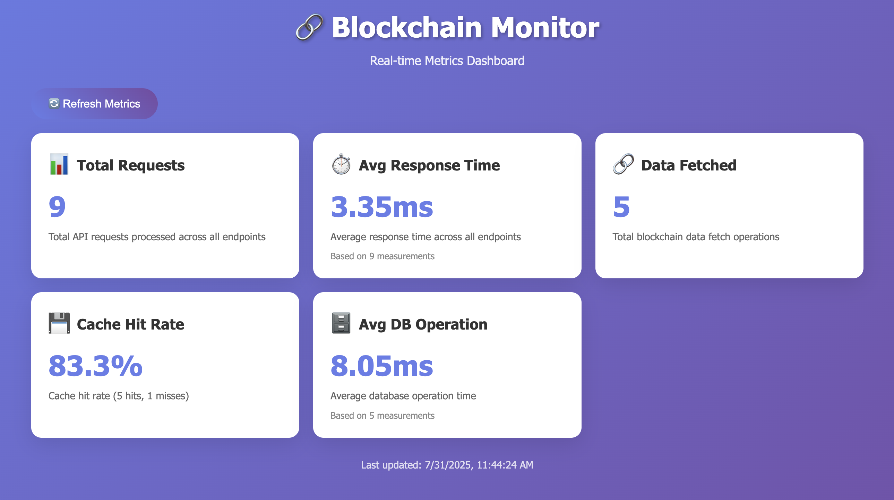

# 🏦 BlockchainMonitor

A comprehensive blockchain monitoring system built with .NET 8, featuring real-time data fetching, caching, event-driven architecture, and advanced monitoring capabilities.

## ✨ Features

- **🏗️ Clean Architecture**: Separation of concerns across layers
- **📊 Real-time Data**: Live blockchain data fetching and monitoring
- **💾 Intelligent Caching**: Memory-based caching with configurable expiration
- **🔄 Event-Driven**: RabbitMQ-based event publishing and consumption for cache invalidation across different services
- **🚪 API Gateway**: YARP-based reverse proxy with load balancing
- **⚡ Rate Limiting**: Built-in request throttling and protection
- **📈 Redis-Based Metrics**: Real-time metrics collection with Redis backend
- **📊 Real-Time Dashboard**: Beautiful web-based monitoring interface with auto-refresh
- **🧪 Comprehensive Testing**: Unit, integration, and E2E tests
- **🐳 Docker Support**: Full containerization with Docker Compose

## 📋 Prerequisites

- .NET 8.0 SDK
- Docker and Docker Compose
- RabbitMQ (included in Docker setup)
- Redis (included in Docker setup)

## 🚀 Quick Start

### 1. Clone the repository
```bash
git clone https://github.com/KaisZaouali/BlockchainMonitor
cd BlockchainMonitor
```

### 2. Run with Docker Compose
```bash
docker-compose -f docker/docker-compose.yml up -d --build
```

### 3. Access the application
- **API Gateway**: http://localhost:5003
- **Swagger UI**: http://localhost:5003/swagger
- **RabbitMQ Management**: http://localhost:15672 (guest/guest)
- **Real-Time Dashboard**: http://localhost:8080 (Auto-refreshing metrics)

### 4. API Endpoints
- `GET /api/blockchain` - Get all blockchain data
- `GET /api/blockchain/{blockchainName}` - Get latest blockchain data for a blockchain name
- `GET /api/blockchain/{blockchainName}/history` - Get blockchain data history for a blockchain name using a default limit of 100.
- `GET /api/blockchain/latest` - Get latest blockchain data
- `GET /health` - Health check endpoint
- `GET /health/detailed` - Health detailed check endpoint
- `GET /swagger`- Get api documentation

### 5. Gateway Endpoints
- `GET /health` - Health check endpoint
- `GET /api/metrics` - Get real-time metrics

### 6. Health Checks
```bash
# Gateway health
curl -f http://localhost:5003/health

# Api health. Internal in docker-compose, you can run it via dotnet run
curl -f http://localhost:5001/health

# Api detailed health. Internal in docker-compose, you can run it via dotnet run
curl -f http://localhost:5001/health/detailed

# Redis health
docker exec blockchainmonitor-redis redis-cli ping

# RabbitMQ health
curl -f http://localhost:15672/api/overview
```

## 🏗️ Project Structure

```
BlockchainMonitor/
├── BlockchainMonitor.API/            # Web API layer
├── BlockchainMonitor.Application/    # Business logic layer
├── BlockchainMonitor.Domain/         # Domain entities and interfaces
├── BlockchainMonitor.Infrastructure/ # Data access and external services
├── BlockchainMonitor.Gateway/        # API Gateway (YARP)
├── BlockchainMonitor.DataFetcher/    # Background data fetching service
├── BlockchainMonitor.Tests.*/        # Test projects
└── docker/                           # Docker configuration
```

## 📊 Redis-Based Monitoring

The application includes comprehensive monitoring with Redis-backed metrics collection:

### **Metrics Collected**
- **Total Requests**: Global request count across all endpoints
- **Response Times**: Average response time in milliseconds
- **Error Counts**: Total errors across all endpoints
- **Cache Performance**: Global hit/miss rates
- **Database Operations**: Average operation times
- **Blockchain Data Fetched**: Total fetch operations
- **Rate Limiting**: Rate limit exceeded events

### **Real-Time Dashboard**
Access http://localhost:8080 to see:
- **Auto-refreshing metrics** every 30 seconds
- **Real-time data** from Redis-backed metrics
- **Global metrics** across all service instances



*The dashboard displays real-time metrics including total requests, response times, cache performance, database operations, and blockchain data fetching with a modern purple gradient interface.*

## 🧪 Testing

### Run all tests
```bash
dotnet test
```

### Tests
- **Unit Tests**: 49 tests covering domain, services, and repositories
- **Integration Tests**: 19 tests covering API endpoints and data flow
- **E2E Tests**: 14 tests covering full application flow with Playwright


## 📈 Performance Features

- **Load Balancing**: API Gateway distributes requests across multiple API instances
- **Caching**: Intelligent memory caching with configurable expiration
- **Cache Invalidation**: Invalidate cache event issued by Datafetcher service and consumed on Api services using RabbitMQ
- **Rate Limiting**: Built-in request throttling (100 requests/minute)
- **Metrics Collection**: Redis-backed performance monitoring
- **Auto-scaling**: Multiple API instances for high availability

## 📚 Documentation

- [Docker Configuration](docker/DOCKER.md) - Detailed Docker setup and deployment
- [API Documentation](http://localhost:5003/swagger) - Interactive API documentation
- [Metrics Dashboard](http://localhost:8080) - Real-time monitoring interface
